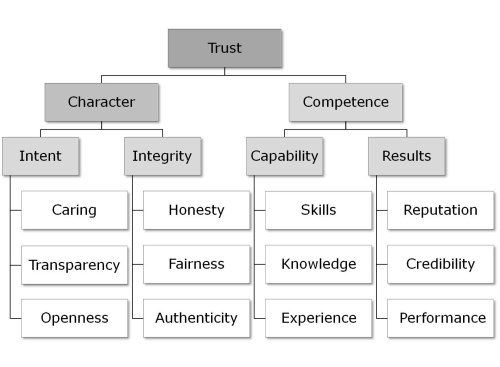

# 21st Century Organizations

## Reinventing Organizations

A great place to start is videos by Frederic Lalaoux, who wrote Reinventing Organizations.
This is a good 10 minute summary of the ideas of Fredric Laloux https://vimeo.com/121517508

See http://www.agileforall.com/2015/04/laloux-cultural-model-and-agile-adoption/ for more info.
> **Lean and Agile Adoption with the Laloux Culture Model** Using the culture model described in Fredric Laloux's book Reinventing Organizations, we examine why lean and agile adoption efforts often struggle to realize their potential and share some ideas for how to make them more successful.

If you want to go beyond this 10 min intro, this is Laloux himself presenting the topic more fully https://www.youtube.com/watch?v=gcS04BI2sbk

## The Coaching Leader & Architect

Another author that has positively influenced me is Roy Osherove. This is a presentation he made on *technical leadership*. I think technical leadership is the heart of any product company’s challenges. https://www.youtube.com/watch?v=uvwW_CRmWmo

As for books on this topic, I recommend _Becoming a Technical Leader_ and other books by Gerald Weinberg
https://www.amazon.com/Gerald-M.-Weinberg/e/B000AP8TZ8

## Collaboration

An important part of collaboration is effective interaction and joint problem solving ... such as using index cards and post-it notes. This TED Talk explains the "management science" behind it. http://www.ted.com/talks/tom_wujec_got_a_wicked_problem_first_tell_me_how_you_make_toast?language=en

## Trust in Business
Joshua Konowe is one of my mentors. I consulted for him and learned a lot
https://www.youtube.com/shared?ci=FaKk5xz66Z0

## It's all about leadership

### The keys to leadership ...

1. modeling absolute trustworthiness
 * personal moral authority and character
 * competencies
2. pathfinding (define the path)
 * vision
 * mission
 * values
3. aligning systems and structures
 * in harmony with moral authority
 * institutionalize the vision/mission/values
 * act consistent with the path
4. empowering people and culture
 * focus on outcomes and desired results
 * freedom and responsibility w/o supervision
 * operate within guidelines

### Principle-Centered Leadership

Stephen R. Covey speaking at the Wharton School, University of Pennsylvania
Watch this video *up to 12m 15s* https://youtu.be/-XUmPKxDXfg?t=4m

To be Principle-Centered everyone needs to know the answer to a simple question: **What is the purpose of our organization?**

### Moral authority

A phrase like "moral authority" sounds preachy to me, so I put it this way:
1. *Act on your gut* — when your stomach is telling you that process/practices/systems/structures are wrong; then either don’t do it or fix it (or at least try).
2. *Act on your heart of hearts* — when you think "if we had it to do all over, we’d do it differently"; then do it differently (or at least try).

People who consistently do 1 & 2 acquire and hold the moral authority.
**You cannot talk your way into Moral Authority; you must behave your way into Moral Authority.**

Here are some common examples:
- _Silos_ within any org there are structural ways to deal with emotional immaturity or dysfunction. Everyone’s gut is saying the same thing; fix the lack of respect and lack of teamwork problem (usually be confronting the gorilla/elephant in the room.) The silos of an organization might be an adaptation to deal with the fact that no one has the "moral authority" to address the dysfunction.
- _Poor Quality_ in some shops there are important components with zero automated tests (or sloppy engineers). In their heart of hearts everyone knows that they should stop working in the code until a set of minimal/essential automated tests are in place. The lack of automated tests is an existing problem that no one has the "moral authority" to turn around.

Leaders give themselves the "moral authority" to act reasonably, rationally, and responsibly. They know what to do and act accordingly. They trust what their gut signals and what their heart of heart tells them.

## Communication

There are two books I’d recommend as *practical* application of improving communication:
- _Turn The Ship Around_ by L. David Marquet https://www.amazon.com/Turn-Ship-Around-Turning-Followers/dp/1591846404
- _Crucial Conversations_ https://www.amazon.com/Crucial-Conversations-Talking-Stakes-Second/dp/0071771328

They’re both quick reads. They’re both about improving *personal leadership* as a way to lower the cost of communication in organizations. Self-directed people require less direction. People who act in line with the program don’t need to be "dealt with".

## Key Elements to Foster

From what I’ve seen organizations must foster these 12 elements:
- Caring
- Transparency
- Openness
- Honesty
- Fairness
- Authenticity
- Skills
- Knowledge
- Experience
- Reputation
- Credibility
- Performance

## Low Trust

If you want to avoid being a low trust organization, there has to be an active effort to bolster the aspects that generate high trust within the organization (and counteract that which diminishes trust).

Here are 6 cancers that diminish trust:
- criticizing
- complaining
- comparing
- competing (unhealthy competition)
- contending (hoarding resources or craving attention)
- cynicism

## Who can manage and lead?

Leadership, in a nutshell: http://www.defmacro.org/2014/10/03/engman.html

Good article on helping others advance. _Is Your Employee Ready to Be a Manager?_ (Harvard Business Review)
https://hbr.org/2016/10/is-your-employee-ready-to-be-a-manager

TL;DR version:
- Gauge interest
- Assess experience
- Test organizational know-how
- Seek other opinions
- Observe
- Heed red flags
- Have faith

If you're interested in coaching, this is a good HBR article
_You Can’t Be a Great Manager If You’re Not a Good Coach_ (Harvard Business Review)
https://hbr.org/2014/07/you-cant-be-a-great-manager-if-youre-not-a-good-coach
The most important thing is having the right kinds of conversations.

Also, check out *Agile Coaching Institute* http://agilecoachinginstitute.com/

These are 3 books I’d recommend:
- *Coaching Agile Teams*, by Lyssa Adkins
- *Agile Coaching*, by Rachel Davis
- *Million Dollar Coaching*, by Alan Weiss

## People are not machines

Zappos is struggling with Holacracy because humans aren’t designed to operate like software
http://qz.com/849980/zappos-is-struggling-with-holacracy-because-humans-arent-designed-to-operate-like-software/

"We want to believe that we are thinking, rational people and on occasion tangle with emotion, flick it out of the way, and go back to thinking," renowned vulnerability expert Brene Brown told a packed house at the Smith Center in downtown Las Vegas just before Labor Day Weekend. "That is not the truth. The truth is we are emotional beings who on occasion think."

## Meetings (Greatly Needed; Often Avoided)

I have often said to teams, "If you want to spend less time in meetings, have shorter meetings."
https://adtmag.com/articles/2016/09/06/agile-5-minute-standup-meeting.aspx

Here are the _standup meeting_ things I’ve tried in the past (that worked)

1. Focus on the work (cards on the board), not going around the room
- Start on the right-hand-side (closest to Shipped!)
- Continue to talk about the cards, moving right to left, top to bottom
- ELMO (Enough. Let's move on.)
- Stop when there's nothing more to talk about
2. The purpose: advance the cards
- How do we move this card forward (improve flow)?
- What is blocked and why?
- Where are bottlenecks forming?
3. The best time of day?
- Put it to the team
- Whatever best helps advance the cards

## S-Curve management

Many tech companies have failed to jump the S-Curve; to create and climb the next S-Curve. Jeff Bezos reinvents Amazon. Jobs did this for Apple. This first article is perhaps _the single best article_ on this topic. It covers things like the *myths*, *horizons*, *vision/strategy/execution* and *leadership* in depth. Well worth a thorough read.
- https://dspace.mit.edu/bitstream/handle/1721.1/104462/958465530-MIT.pdf

Here are a few other articles on this topic:
- _Reinvent Your Business Before It’s Too Late_ https://hbr.org/2011/01/reinvent-your-business-before-its-too-late
- https://www.bloomberg.com/news/articles/2004-08-18/jeff-bezos-blind-alley-explorer
- http://www.forbes.com/forbes/2012/0423/ceo-compensation-12-amazon-technology-jeff-bezos-gets-it.html

## Playful culture
"A company’s ability to produce laughter on the internet is proportional to its ability to innovate" — Albert Einstein.
https://medium.com/@orenellenbogen/playful-culture-1370b18344c7#.s6bfqg6tt

## Agile, Scrum and Lean

The lean-change loop and the PDCA cycle are really all about the OODA loop https://en.wikipedia.org/wiki/OODA_loop

In software development, we’re largely adopting (or trying to adopt) the Scrum Framework with 1 week sprints. However, this book (a *very* short book) explains how to combine Kanban and Scrum. It’s a free download if you register for InfoQ.
_Kanban and Scrum - Making the Most of Both_ https://www.infoq.com/minibooks/kanban-scrum-minibook

This article describes what I generally believe ... Scrum is crawling, Scrumban is walking, and Lean+Kanban+CD is running. It provides a number of ways we can improve our processes.
http://www.engineerbetter.com/2017/05/05/anthropic-sympathy.html

> We observed that businesses are fundamentally made of only two things: the hard-earned money of shareholders, and the easily-spent time of employees. Whenever an organization does something inefficient, it’s wasting one of these two resources.
> One has a moral responsibility to change unfit processes

My thinking is we ought to focus on:
- finding way to encourage changes to unfit processes (lean waste removal)
- improving CD pipeline robustness (e.g. end-to-end, multi-browser testing) - automated testing in new and better ways
- per product manager we hire, a single prioritized backlog
- squads experimenting with daily cadence around a Kanban board

The challenge is to maintain quality (in an automated way) for a quickly growing product codebase. We have a growing number of dimensions to test, so we need a solution that scales with it, and is part of our pipeline.

More broadly, my current thinking ... I’ve found that motivated and maturing teams quickly outpace the experienced ones. The key is to focus people on the right things:
- our process has waste, how can we incrementally and continuously improve it?
- we can’t operate in a sustainable way if we’re always watching the clock, how can we better prioritize our work?
- we need to maintain quality in a systematic and scalable manner, how do we do it?

With regard to L+K, whenever a team is _pulled_ by the shifting, external needs then Kanban is a very good way of expediting the work. Here are a couple of suggestions:
1. use the analogy of a restaurant: tickets come from the customers, they queue up in the kitchen, the goal is to expedite the tickets so that the food leaves quickly with great quality to the hungry customers.
2. make sure the tickets are "correctly sized": smallest practical size. Again, the restaurant analogy suggests that the ticket should cover all the food for only one table, but you expedite the appetizers first, then the entrees, then the deserts. Split the tickets into a logical progression, but each increment is a complete set (all the apps go out together).

Ticket/issue sizing is a common problem.
https://blog.backlogapp.io/how-to-make-ux-and-ui-design-work-with-incremental-development-828642e8a249

Covey:
1. personal character -- trustworthiness, trust, maturity and empathy
2. purpose -- vision, foresight, motivation, and communication
3. self-discipline -- prioritization, planning and preparation

Dearing:
1. Personal Exceptionalism -- they believe _they are special_
2. Dichotomous Thinking -- _black and white extremes_
3. Correct Overgeneralization -- _make universal judgments_ from limited observations
4. Blank-Canvas Thinking -- they _invent new rules_
5. *Schumpeterianism* -- they believe in _disruptive innovation_ and _creative destruction_

The Five Cognitive Distortions of People Who Get Stuff Done - Manage By Walking Around
http://jonathanbecher.com/2014/04/14/five-cognitive-distortions-people-get-stuff-done

Interestingly, I think the best leaders I have known have *both* but not too much of either:
-- _the wise leader_: the compassion and judgement of the Covey model
-- _the benign dictator_: very high standards (perfectionism), indifference to status quo, and real ambition of the Dearing model

### The Evolution of the Employee

### Mindset-shift 21st Century Orgs

Traditional management misses the fact that the best of the best want to work for orgs on the right *AND*, in knowledge work, the best of the best are :100: times more able to outperform your competitor (or vice versa).
(this wasn’t so for coal miners, factory workers, or clerical staff)

An oldie but a goody: *vanity metrics vs actionable metrics*
Vanity Metrics vs. Actionable Metrics – Guest Post by Eric Ries
https://tim.blog/2009/05/19/vanity-metrics-vs-actionable-metrics/

This is a better article on why *vanity metrics* are bad for startups:
Why vanity metrics are dangerous http://www.startuplessonslearned.com/2009/12/why-vanity-metrics-are-dangerous.html

TL;DR — when they go up it’s because of what my team’s doing; when they go down it’s because of what another team is doing.

This article describes seven distinct action-logic categories: Opportunists, Diplomats, Experts, Achievers, Individualists, Strategists, and Alchemists
TL;DR — the first three are associated with below-average performance, the latter four with medium to high performance. Transformation involves ...
- *becoming more "sensitive"* (aware of a greater range of information, from within and around you)
- *making sense of this information differently* (from the perspective of a more complex "action-logic" category)
- *acting differently* (consciously choosing responses that are more aligned with your intention, as opposed to reacting out of habit)
https://hbr.org/2005/04/seven-transformations-of-leadership

## My reading list

https://www.amazon.com/Coaching-Habit-Less-Change-Forever/dp/0978440749/

https://www.happymelly.com/how-to-run-a-lean-change-cycle/

http://firstround.com/review/warning-this-is-not-your-grandfathers-talent-planning/
